# Prithish Soni - Data Analyst Portfolio
## Following are my projects in SQL, Python, Tableau and Excel

Website: [Add your website link here](https://prithishsoni.com)

LinkedIn: [Prithish Soni](https://www.linkedin.com/in/prithishsoni)

- [x] **SQL & Tableau** - 
  - Instagram Clone Data Analysis Project 
*Review the Data Insertion SQL Script:* **[HERE](projects/sql/instagram-clone/Instagram%20Clone%20SQL%20-%20Database%20%26%20Inserting%20Data.sql)** 
*Review the Data Exploration SQL Script:* **[HERE](projects/sql/instagram-clone/Instagram%20Clone%20SQL%20-%20Exploratory%20Data%20Analysis.sql)** 

- [x] **SQL** - 
  - Nashville Housing Dataset: Data Cleaning  
*Review the SQL Script:* **[HERE](projects/sql/nashville-housing/SQL%20-%20Data%20Cleaning.sql)** 

  - COVID-19 Dataset: Data Exploration   
*Review the SQL Script:* **[HERE](projects/sql/covid-19/SQL%20-%20Data%20Exploration.sql)** 

- [x] **PostgreSQL** - 
  - Business Intelligence Challenge  
*Review the PostgreSQL Script:* **[HERE](projects/postgresql/bi-challenge/PostgreSQL-BI-CHALLENGE)** 
*Review the Google Slides Deck to see the Data Visualizations:* **[HERE](https://drive.google.com/file/d/1JIDnsaLXAx2qnWM86yfrRKLWF5B_ofHU/view?usp=sharing)** 

- [x] **Python** - 
  - Movies Industry Dataset: Exploratory Data Analysis Project  
*Open the project notebook:* **[HERE](projects/python/movie-industry-eda/Python%20-%20Movie%20Industry%20EDA%20Project.ipynb)** 

- [x] **Tableau** - 

*Tableau Dashboard Showcase*

- #MakeoverMonday 2020 Week 32 | Benefits of Working from Home

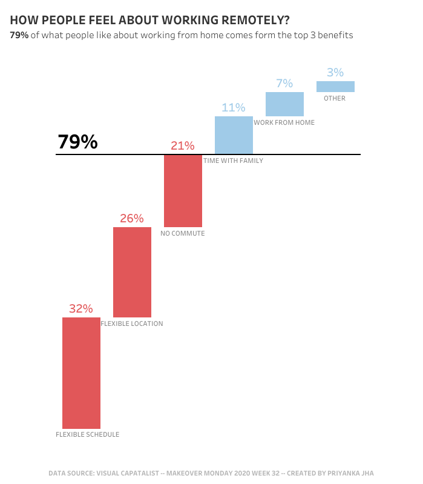  

- Municipality Data Analysis Dashboard

  

- GROVER Junior Data Analyst Case Study Dashboard

  

- Retail Pricing Analytics Dashboard

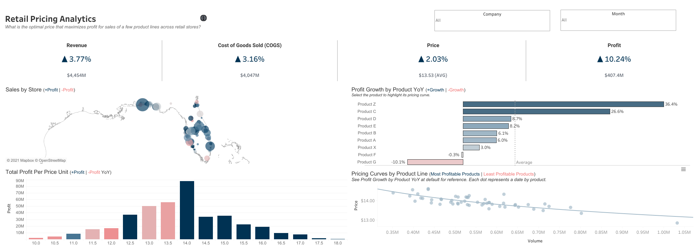

- E-commerce Sales Dashboard

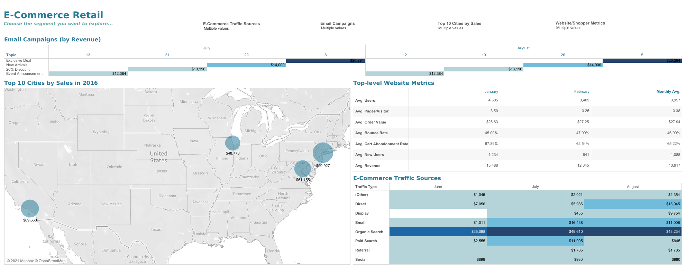

- Sales SuperStore Deep Data Analysis (5 Dashboards)
      
      1 KPI Dashboard

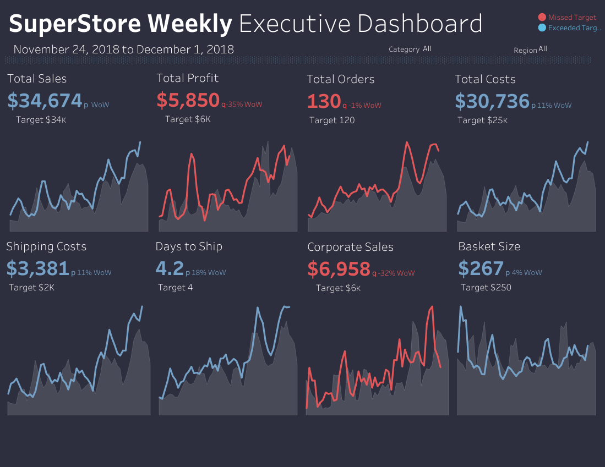

      2 Top-Down Dashboard
      
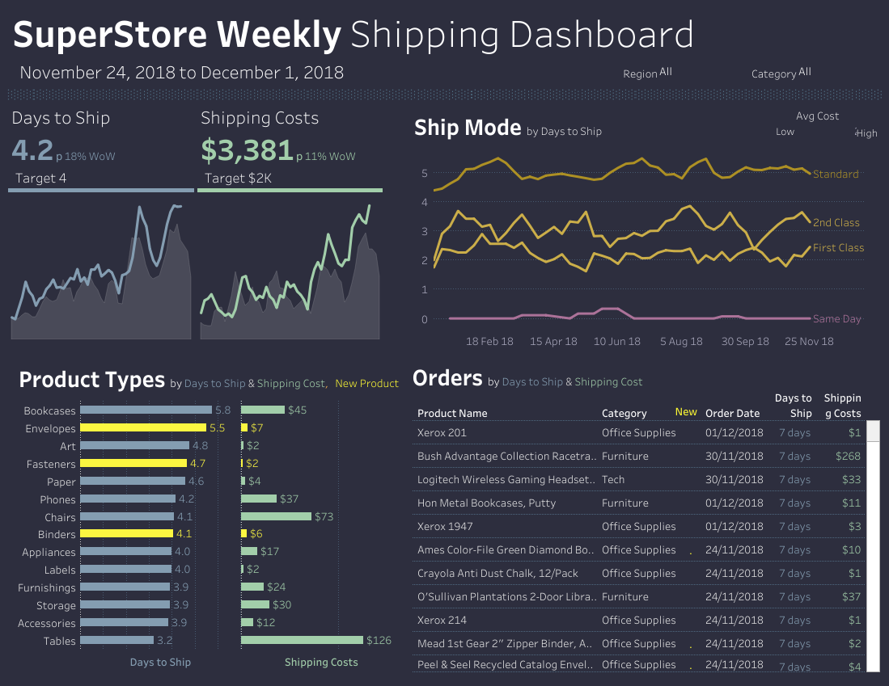

      3 Q&A Dashboard
      
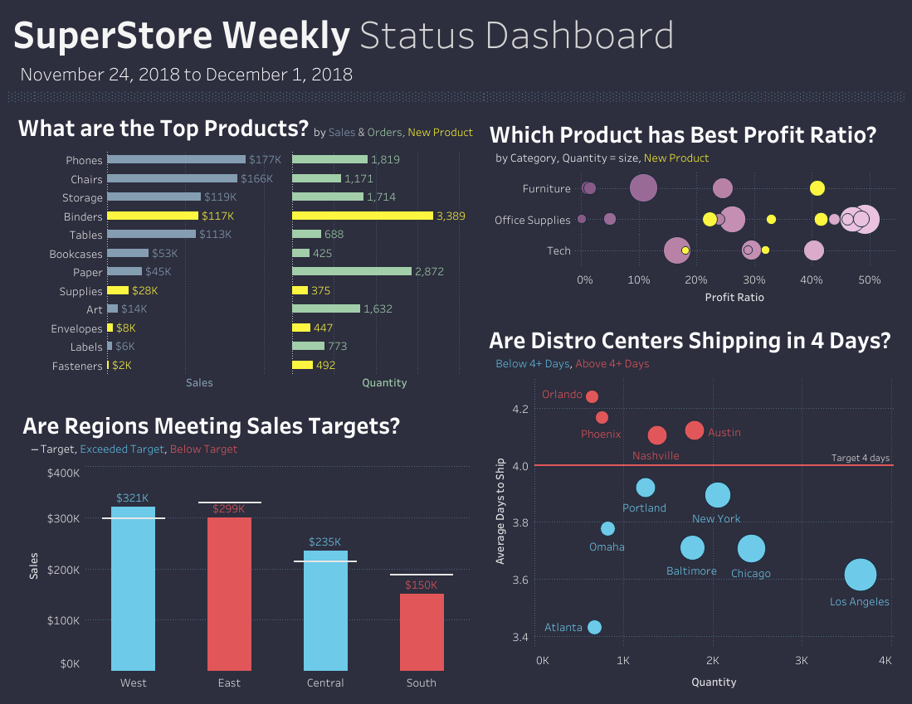

      4 Bottom-Up Dashboard
      

      5 Geo Chart
      

- World Bank CO2 Emissions Dashboard

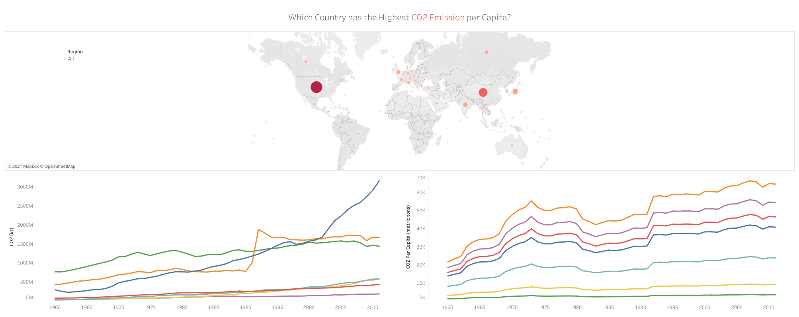

- London Bus Safety Dashboard

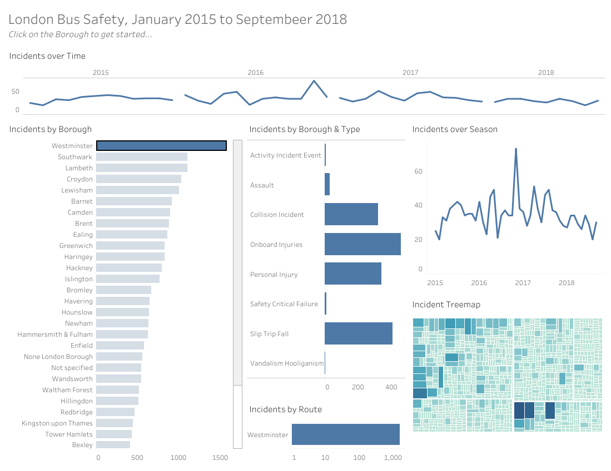

- [x] **Excel** - 

*Kindly download these Excel files from this repository and view them in Microsoft Excel.*

- Sales Superstore Sample: Sales Performance Dashboard  

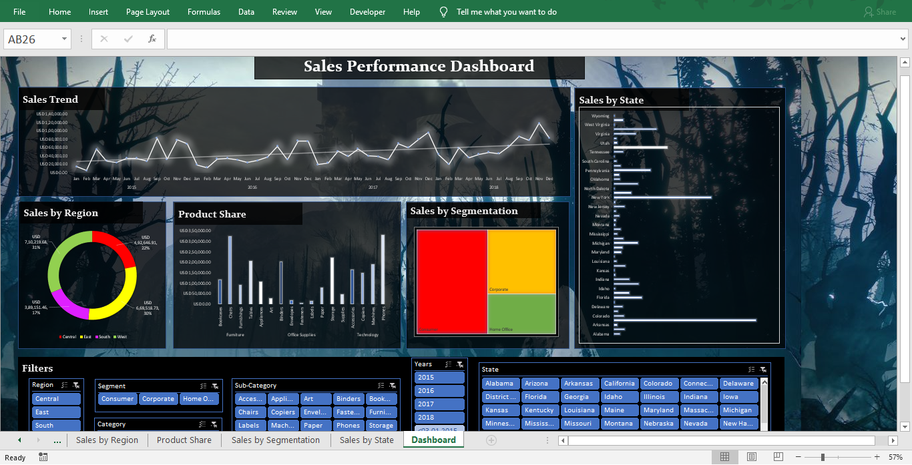

- NetTRON Network Infrastructure Data : LOOKUP, INDEX, MATCH, SUMIFS  

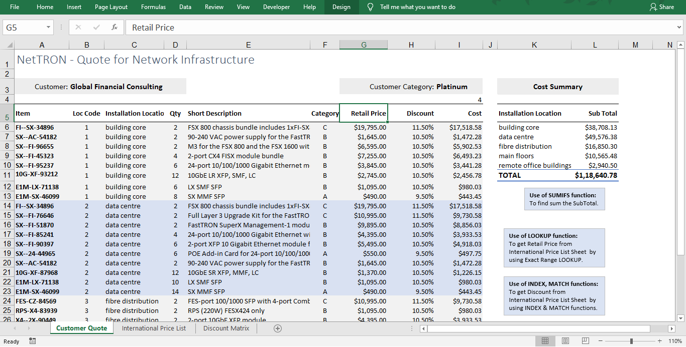

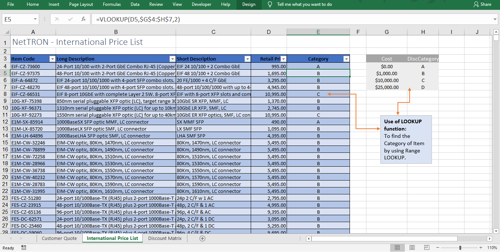

- Shipping Data: Pivot Tables, Pivot Chart, Slicers  

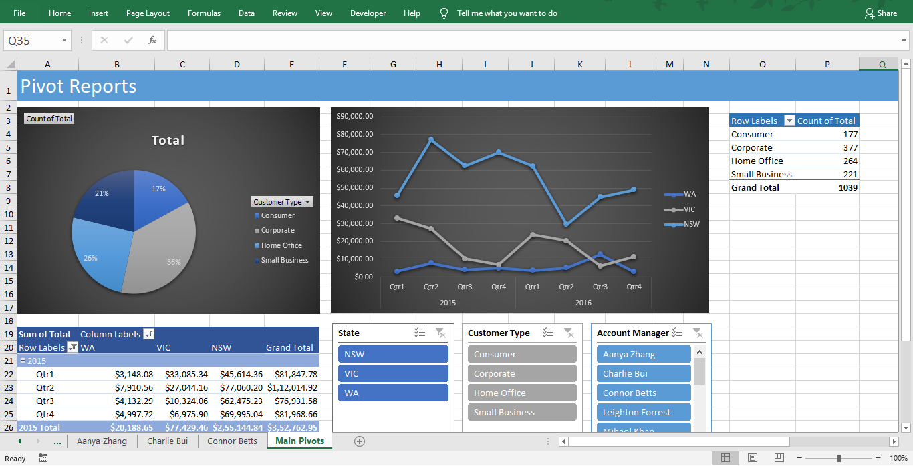

- Project Costing Model Data: Scenario Manager, Solver (Data Modeling)

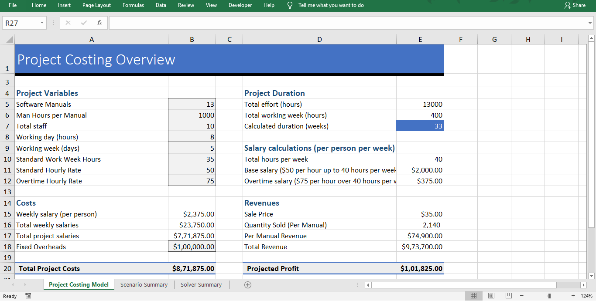

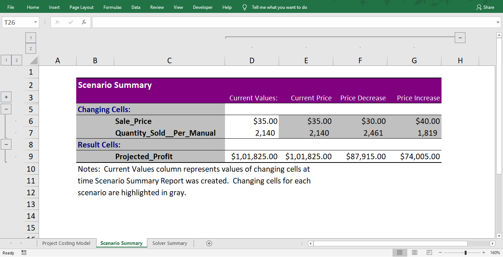

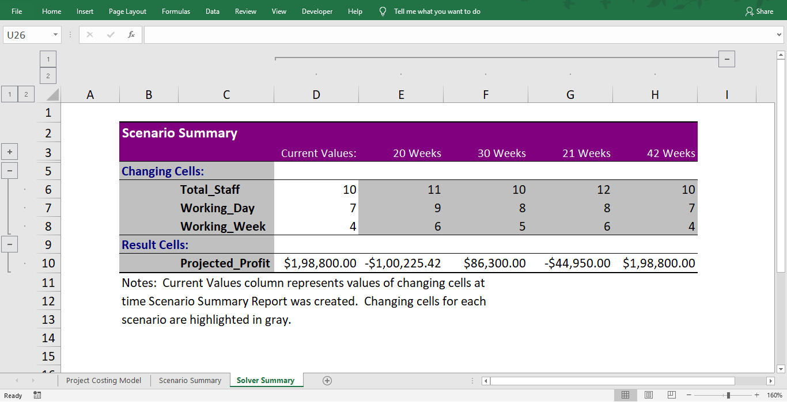

--------------------------------------------------------------------------------------------------------------------------------------------------------------------------------
